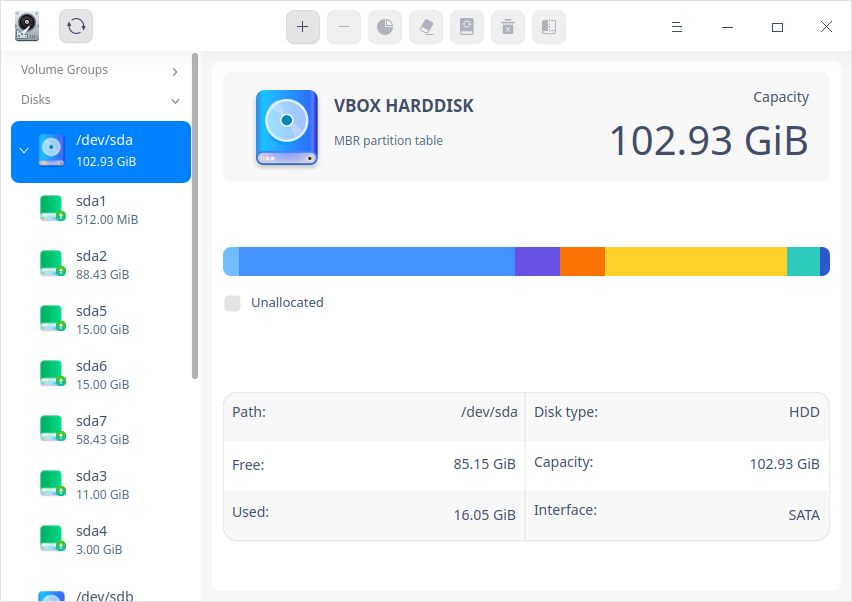
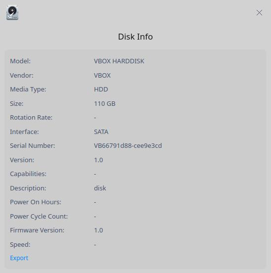
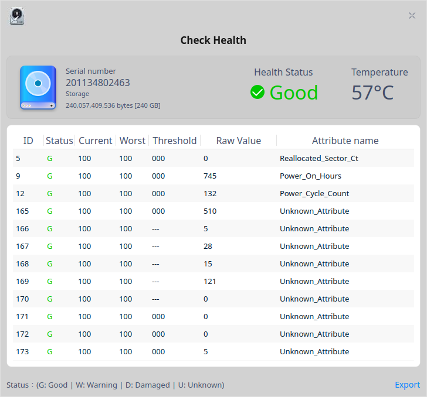
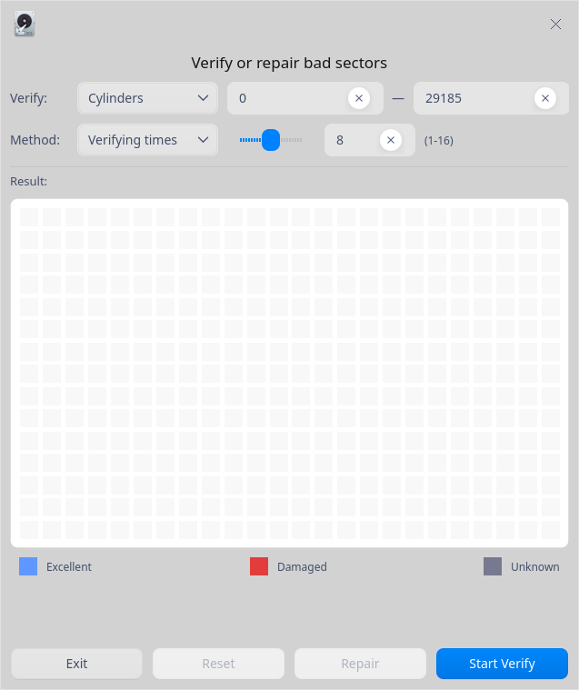
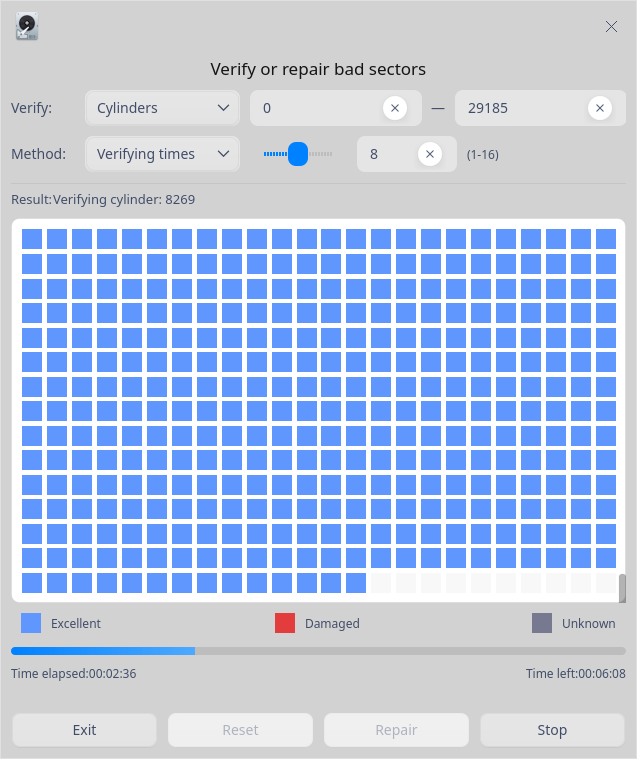
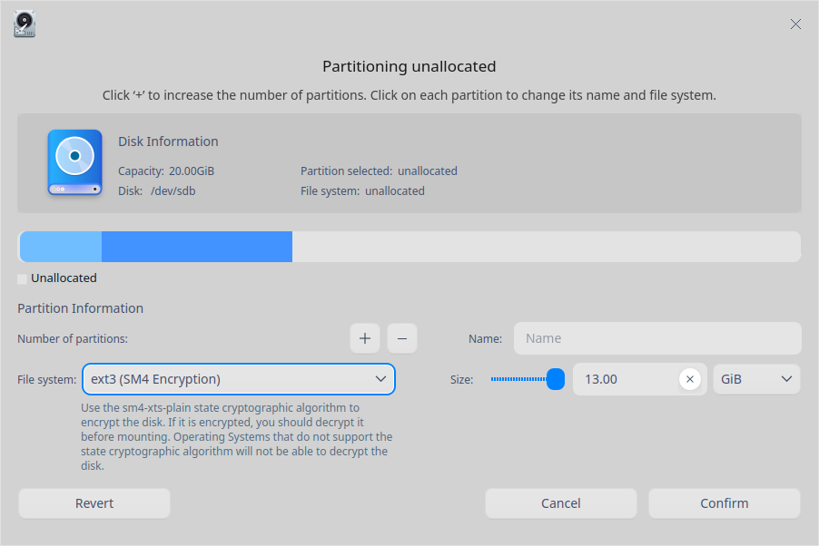
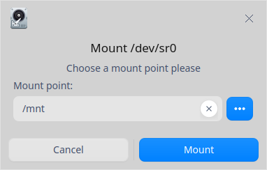
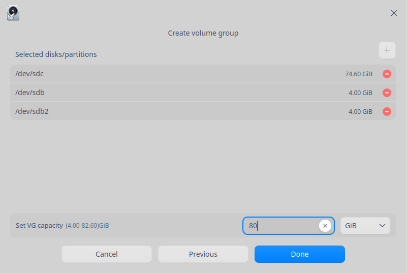
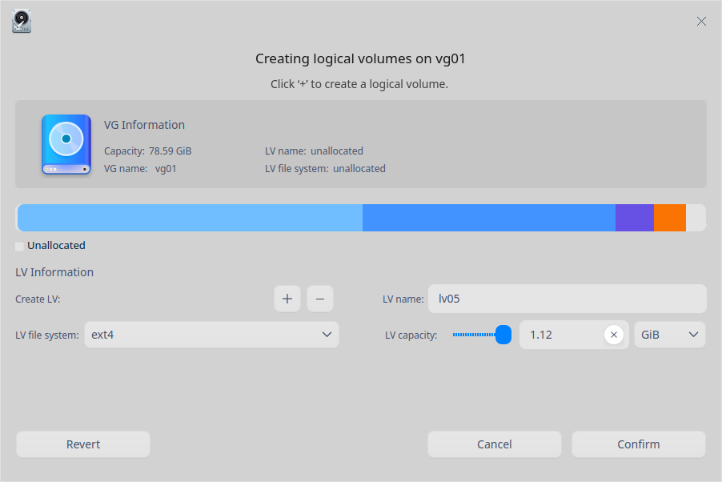
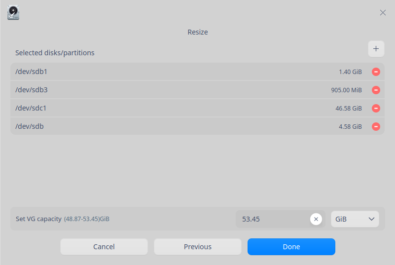

# Disk Utility|deepin-diskmanager|

## Overview

Disk Utility is a useful disk management tool,  which help the user to view the basic information of disks and create and manage logical volumes.

## Guide

You can run, close, and create a desktop shortcut for Disk Utility in the following ways.

### Run Disk Utility

1. Click  in the Dock and enter the Launcher interface.
2. Locate  by scrolling the mouse wheel or searching "disk utility" in the Launcher interface and click it to run. An authentication box pops up. Enter the password for authentication. 

   

3. Right-click  to:

 - Click **Send to desktop** to create a desktop shortcut.
 - Click **Send to dock** to fix the application in the Dock.
 - Click **Add to startup** to add the application to startup and it will automatically run when the system starts up.

### Exit Disk Utility

- On the Disk Utility interface, clickto exit Disk Utility.
- Right-click  in the Dock and select **Close All** to exit Disk Utility.
- On the Disk Utility interface, click  and select **Exit** to exit Disk Utility.

## General Operations

### Disk Management

On the Disk Utility interface, you can view the disk info, perform health management and create partition tables, etc. As for the partitions, you can perform operations such as creating, resizing, mounting, unmounting and wiping partitions.

> Attention: 
>
>- Force quit during operation may cause abnormal performance of Disk Utility. Please proceed with caution.
>- If a partition of the system disk is mbr extended partition, logical partition or logical volume, please proceed with caution to avoid system crashes.

#### View Disk Info

1. On the Disk Utility interface, a list of disk(s) and information about relevant partition(s) are displayed. Click the  icon to refresh the current interface.
    

2. Right-click a disk and select **Disk info** to view the serial number, vendor, device model, user capacity, rotation rate of the disk, etc.
   
   
3. Click **Export** to export the disk info to your designated folder. 

#### Create Partition Table

There are two cases for creating a partition table:

- If the disk is normal but there is no partition table, it is unavailable to be operated. Therefore, please create a partition table in advance.
- If there is a partition table in the disk, e.g. MSDOS, it is available to switch to the GPT partition table after creating a partition table.

Please note that you need to unmount all the partitions in the disk before performing the operations above.

1. On the Disk Utility interface, right-click a disk and select **Create partition table**.
2. Select GPT or MSDOS partition and then click **Create**.

>  Attention: All partitions in this disk will be merged and all data will be lost in the process of creating a new partition table. Please backup your data first.   

#### Run Health Management

**Check Health**

1. On the Disk Utility interface, select a disk. Right-click it and select **Health Management** > **Check health**. 
2. You can check the health status, current temperature, and status of different attributes of the disk.

&nbsp;&nbsp;&nbsp;&nbsp;&nbsp;&nbsp;&nbsp;&nbsp;&nbsp;&nbsp;&nbsp;&nbsp;&nbsp;

3. Click **Export** to export the health check results of the disk to your designated folder. 

**Check Partition Table Error**

1. On the Disk Utility interface, select a disk. Right-click it and select **Health Management** > **Check partition table error**. 
2. If there is no error in the partition table, a **No errors found in the partition table** prompt will pop up; if an error is found in the partition table, an **Errors in the partition table** report will pop up. 

**Verify/Repair Bad Sectors**

Bad sectors may occur commonly in disks, which need to be verified and repaired periodically. 

1. On the Disk Utility interface, right-click a disk and select **Health management** > **Verify or repair bad sectors**.

2. Set the range and method and click **Start Verify** to verify the selected disk.

   

3. Click **Stop** to stop the verification at any time and click **Continue** to resume the verification.

   

4. You can perform the following operations after the verification is completed.

- Exit the verification interface directly when no bad sector is detected. 
- Click **Repair** to repair the bad sectors detected.

> Attention: Bad sector repairing may destroy data on and near bad sectors instead. Please back up all data before repair.

You can also click **Reset** to clear all the current data detected and enter the initial  **Verify or repair bad sectors** interface.

   #### Create a Partition

1. On the Disk Utility interface, select an unallocated partition, and click the Partition icon  on the top toolbar.
2. A confirmation dialogue pops up. Click **Confirm** to enter the unallocated partitioning interface, where you can view the size, name, and file system of this partition, and read information of the disk where this partition locates. 
3. In the partition information area, fill in the name and size of partition, select the file system of partition, and click the  icon. You can also create multiple partitions, and each partition name will be displayed on the bar graph under disk information. You can delete a partition by clicking the  icon when you're creating a new partition.

>  Attention: It is available to create four msdos partitions at most.  While for gpt partitions, a maximum of 24 partitions can be created at one time and 128 partitions in total. To create a partition, you need a storage space of at least 52 MiB. 

4. After setting up, click **Confirm**. The newly-created partition will be displayed under the corresponding disk. 
5. The new partition will be automatically formatted when you create it. You can use the newly-created partition after it's mounted. Please refer to [Mount a Partition](#Mount a Partition) for detailed information.

#### Resize a Partition

You can resize a partition. Please note that you can only resize an unmounted partition.

1. On the Disk Utility interface, select an unmounted partition, and click the Resize icon  on the top toolbar.
2. A resizing interface pops up. Fill in the new capacity.

   - Expand space: It supports downward expansion currently. Only when there is an unallocated partition downward next to the selected partition, can you expand space and the new capacity cannot be greater than the total capacity of the current partition and the unallocated partition. Otherwise, it is unavailable to expand space for the partition.
   - Shrink space: Please back up your data before the operation.

3. Click **Confirm**. You can view the capacity of the partition once it's resized.

> Notes:  Partitions with the FAT32 file system cannot be shed.

#### Wipe a Disk/Partition

It is available to wipe unmounted disks and partitions.

1. On the Disk Utility interface, select a disk or partition and click the Wipe  icon on the top toolbar.
2. A wiping interface pops up. Fill in the name and select the file system and security option. There are three security options, namely Fast, Secure and Advanced, with the Fast option as the default.
   - Fast:  It only deletes the partition info without erasing the files on the disk. Disk recover tools may recover the files with a certain probabality.
   - Secure: It is a one-time secure wipe that complies with NIST 800-88 and writes 0, 1, and random data to the entire disk once. You will not be able to recover files, and the process will be slow.
   - Advanced: There are two wiping methods, namely DoD 5220.22-M and Gutmann. It writes 0, 1, and random data to the entire disk several times. You can set the number of times to erase disks and overwrite data, but the process will be very slow.

>  Notes: The DoD 5220.22-M and Gutmann wiping methods are not available for solid state drives (SSD). When it is SSD, there are only Fast and Secure options in the Security dropdown list.

3. Click **Wipe**.  The wiped partition will be mounted automatically. 

#### Mount a Partition

1. On the Disk Utility interface, select an unmounted partition and click the Mount  icon on the top toolbar.
2. A mounting interface pops up. Select or create a mount point, and click the **Mount** icon to mount it.

&nbsp;&nbsp;&nbsp;&nbsp;&nbsp;&nbsp;&nbsp;&nbsp;&nbsp;&nbsp;&nbsp;&nbsp;&nbsp;

>  Attention: A partition can be mounted to an existing directory and such directory can be not empty. However, once mounted, all previous files and contents under this directory will not be available. Please proceed with caution. 

#### Unmount a Partition

If you want to change the mount point of a partition, you can unmount it first, and then mount it again.

1. On the Disk Utility interface, select a partition and click the Unmount  icon on the top toolbar.

2. A confirmation dialogue pops up. Click **Unmount** if you confirm that there are no programs running on the partition.

   > Attention:  Unmounting the system disk may cause system crashes. Please proceed with caution. 

#### Delete a Partition

Once a partition is deleted, you will lose all data in it. Please proceed with caution.

1. On the Disk Utility interface, select an unmounted partition and right-click it. 
2. Select **Delete partition** and a confirmation dialogue pops up. Click **Delete**, and this partition will disappear from the corresponding disk.

### Logical Volume Manager

Logical volume manager is a logical layer based on the disk and partition. With it, you can create and manage logical volumes rather than use the physical hard disk directly, thereby improving the flexibility of disk and partition management.

#### Create a Volume Group

1. On the Disk Utility interface, click the Create volume group icon on the top toolbar.
2. A confirmation dialogue pops up. Click **Confirm** to enter the Create volume group interface, where you can view and select the  name and capacity of the disks and partitions available. The disks and partitions that are not shown include the following:

   - The disk where the boot partition is located
   - Read-only disks
   - Partitions or disks that are added to the other logical volume
   - Mounted partitions
   - Unallocated partitions that cannot used to create new partitions
   - Disks with partition table errors
   - Partitions or disks with a capacity of less than 100 MiB

3. Click **Next**. You can click the  icon or  the  icon to add or delete the number of disks or partitions selected. You can also realize this by clicking the **Previous** icon to go back to the former page to reselect the disks and partitions.

   

4. Set the capacity for the volume group and click the **Done** icon to finish creating the volume group. The newly-created volume group is displayed on the left panel with the default name of vg01, vg02, etc.

>   Notes: Only when there is an unallocated partition or disk without partition table selected, can you set the capacity of the volume group manually.

#### Create a Logical Volume

1. On the Disk Utility interface, select an unallocated logical volume or a volume group with an unallocated logical volume, and click the Create logical volume icon  on the top toolbar.
2. A confirmation dialogue pops up. Click **Confirm** to enter the creating logical volumes interface, where you can view the size, name, file system of this volume and other information. 
3. In the creating logical volumes interface, fill in the size of volume, select the LV file system, and click the  icon. You can also create multiple volumes, and each volume will be displayed on the bar graph under VG information. You can delete a volume  by selecting it and clicking the  icon when you're creating a new volume.

> Attention: The capacity of the newly-created logical volume shall be integral multiples of 4 MiB, with 4 MiB as its minimum capacity.

4. Click the **Confirm** icon to finish creating the logical volume. The logical volume created will be mounted automatically and displayed under the corresponding volume group.

#### Resize a Volume Group/Logical Volume

It is available to resize a volume group or logical volume according to the actual needs. Please back up your data before shrinking the volume group  or logical volume.

Please refer to [Resize a Partition](#Resize a Partition) in the Disk Management section for the detailed operations of resizing a logical volume.  Please note that logical volumes with the FAT32 file system cannot be resized.

Please refer to the following steps for resizing a volume group:

1. On the Disk Utility interface, select a volume group, and click the Resize icon  on the top toolbar.

2. A resizing interface pops up with all the disks and partitions available displayed. You can choose to expand or shrink the space.

   

   

3. Select the corresponding disks and partitions and click the **Next** icon.
4. The selected disks or partitions will be displayed on top of the resizing interface.  Click  or  to add or remove a disk or partition respectively. Set the capacity for the volume group and click the **Done** icon to finish resizing the volume group. 

>   Notes: Only when there is an unallocated partition or disk without partition table selected, can you set the capacity of the volume group manually.

#### Wipe a Logical Volume

Wiping a logical volume is similar with wiping a disk or partition. Please refer to [Wipe a Disk/Partition](#Wipe a Disk/Partition) in the Disk Management section.

#### Mounting a Logical Volume

Mounting a logical volume is similar with mounting a partition. Please refer to [Mount a Partition](#Mount a Partition)in the Disk Management section.

#### Unmounting a Logical Volume

Unmounting a logical volume is similar with unmounting a partition. Please refer to [Unmount a Partition](#Unmount a Partition) in the Disk Management section.

#### Delete a Logical Volume

The data cannot be recovered after a logical volume is deleted. Please proceed with caution.

1. Select an unmounted logical volume and right-click to choose **Delete logical volume** or click the 

    icon on the top toolbar.

2. Click the **Delete** icon and the capacity of the logical volume deleted will be released to the unallocated logical volume in the volume group.

#### Delete a Volume Group

The data cannot be recovered after a volume group is deleted. Please proceed with caution.

Please make sure that all the logical volumes under the volume group are unmounted before deleting it.

1. Select a volume group and right-click to choose **Delete volume group** or click the  icon on the top toolbar.
2. Click the **Delete** icon to delete it.

#### Delete a Physical Volume

1. Select a disk or partition that has been added to the other volume group and click  the  icon on the top toolbar.
2. The data contained will be lost after deleting the physical volume. Please proceed with caution. Click the **Delete** icon after confirmation.
3. The physical volume can be deleted if its space is no more than the remaining space of the volume group. Otherwise, it cannot be deleted. It is recommended to delete the corresponding logical volume first, and then choose to delete the physical volume.

## Main Menu

In the main menu, you can switch window themes, view help manual, and get more information about Disk Utility.

### Theme

There are three window themes, namely Light Theme, Dark Theme, and System Theme.

1.  Click  On the Disk Utility interface.
2.  Click **Theme** to choose one theme.

### Help

1.  Click  On the Disk Utility interface.
2.  Click **Help** to view the manual of Disk Utility.

### About

1.  Click  On the Disk Utility interface.
2.  Click **About** to view the version and introduction of Disk Utility.

### Exit

1.  Click  On the Disk Utility interface.
2.  Click **Exit** to exit Disk Utility.